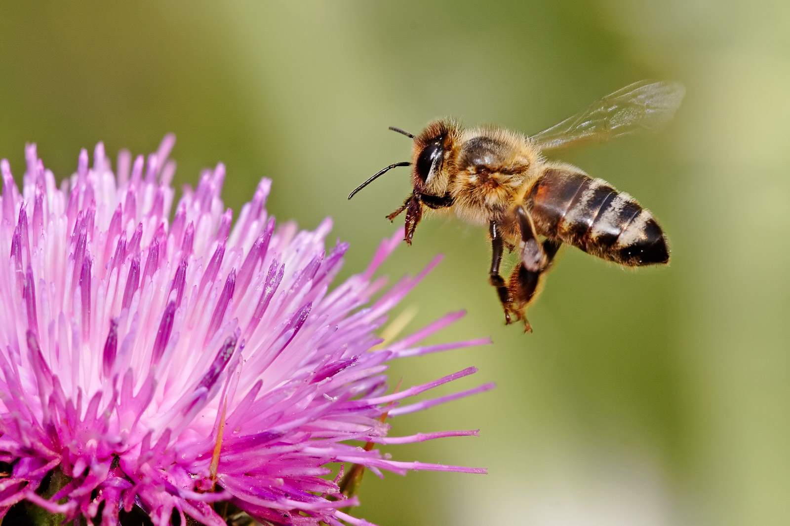
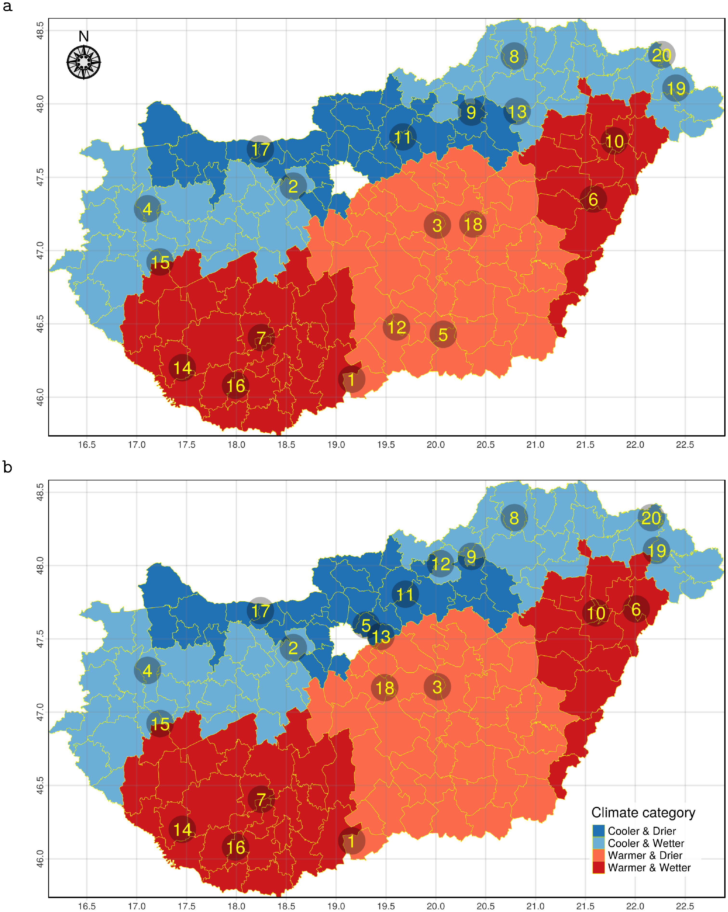

```{r setup, include=FALSE,  results='hide'}
knitr::opts_chunk$set(#echo = FALSE, 
                      warning = FALSE,
                      message = FALSE,
                      fig.align = 'center',
                      #fig.width = 5,
                      fig.width = 600 / 72,
                      dpi = 72,
                      out.width = "100%")
#options(knitr.table.format = function() {
#  if (knitr::is_latex_output()) 'latex' else 'pandoc'
#})
```

<style>
body {
text-align: justify}
</style>

```{r, echo=FALSE, message=FALSE, warning=FALSE, results='hide', error=FALSE}
source("code/0_Load_Packages.R", local = knitr::knit_global())
```

<!-- #  {.tabset .tabset-fade} -->

# Abstract
As pollinators and producers of numerous human-consumed products, honey bees have great ecological, economic and health importance. The composition of their bacteriota, for which the available knowledge is limited, is essential for their body’s functioning. Based on our survey, we performed a metagenomic analysis of samples collected by repeated sampling. We used geolocations that represent the climatic types of the study area over two nutritionally extreme periods (March and May) of the collection season. Regarding bacteriome composition, a significant difference was found between the samples from March and May. The samples’ bacteriome from March showed a significant composition difference between cooler and warmer regions. However, there were no significant bacteriome composition differences among the climatic classes of samples taken in May. Based on our results, one may conclude that the composition of healthy core bacteriomes in honey bees varies depending on the climatic and seasonal conditions. This is likely due to climatic factors and vegetation states determining the availability and nutrient content of flowering plants. The results of our study prove that in order to gain a thorough understanding of a microbiome’s natural diversity, we need to obtain the necessary information from extreme ranges within the host’s healthy state.

```{r, out.width = "60%", fig.cap="Apis mellifera", echo=FALSE}

```

In this study we sequenced 40 bee metagenome and sought the answers for the following:

* Spatial difference in metagenomes
* Geographical pattern of viruses and bacteria
* Environmental pattern in metagenome
* Temporal/Periodical change in metagenome

To allow for the investigation of the temporal variation in metagenome we did two sampling on the same twenty bee family.
Selection of the sampling locations (bee families) were done with a stratified random method (e.g. GRTS in spsurvey package). After contacting the local beekeepers, we did one sampling in March and one in May. For a tutorial on how the selection of the sampling sites worked see the section of [Selecting sampling locations](#selecting-sampling-locations)

The published paper can be found here: 

#### Natural diversity of the honey bee (Apis mellifera) gut bacteriome in various climatic and seasonal states {.unlisted .unnumbered}

[https://journals.plos.org/plosone/article?id=10.1371/journal.pone.0273844](https://journals.plos.org/plosone/article?id=10.1371/journal.pone.0273844)

**Data Availability:** The short read data of samples are publicly available and accessible through the PRJNA685398 from the NCBI Sequence Read Archive (SRA).

**Citation:** Papp M, Békési L, Farkas R, Makrai L, Judge MF, Maróti G, et al. (2022) Natural diversity of the honey bee (Apis mellifera) gut bacteriome in various climatic and seasonal states. 
PLoS ONE 17(9): e0273844. https://doi.org/10.1371/journal.pone.0273844


# Sampling locations
Sampling design and sample collection

The study’s main goal was to understand the natural variability in the gut bacteriome of healthy honey bees (Apis mellifera). To measure seasonal variation, two sampling occasions were planned, one at the onset and one at the peak of the honey producing season. However, as season is not the only variable that could be considered when one is interested in the factors that could affect the bacteriome (climate could be an important environmental factor as well), we have determined our samples to be representative of Hungary on the climate level. To obtain such samples, we conducted a stratified spatial random sampling [[23](https://journals.plos.org/plosone/article?id=10.1371/journal.pone.0273844#pone.0273844.ref023)] as detailed below.

We gathered the 10 year average of the yearly growing degree days (GDD) with base 10 [[24](https://journals.plos.org/plosone/article?id=10.1371/journal.pone.0273844#pone.0273844.ref024), [25](https://journals.plos.org/plosone/article?id=10.1371/journal.pone.0273844#pone.0273844.ref025)] and the yearly total precipitation data for all the 175 local administrative units (level 1, hereafter refered to as LAU) in Hungary. Meteorological data for the period 2008–2017 was gathered from the ERA-Interim reanalysis data repository [[26](https://journals.plos.org/plosone/article?id=10.1371/journal.pone.0273844#pone.0273844.ref026)] by the spatial resolution of 0.125°. We defined the two categories for our environmental variables as cooler-warmer and less-more for GDD and precipitation respectively.

Regarding GDD, the lower two quartiles were classified as cooler and the upper two quartiles as warmer. For precipitation, the yearly mean below the country-wide median was assumed as less and above the median as more. Each LAU was categorised by its own climatic variables (Fig 1). We created separate strata for each combinations of our two environmental variables.


```{r, out.width = "100%", echo=FALSE}

```

The figure shows the location of the sampling locations in March (top) and in May (bottom). Some of the bee families have been moved during these 2 months and some of them even switched category according to precipitation or GDD. This has been accounted for in the study.

More detail about sampling site selection is here [here](#selecting-sampling-locations)

# Clean the initial excel table
We provide the cleaned the data file, but here is the code used for cleaning the initial data to give feeling about the possible errors that might have entered the pipeline.
```{r child="code/1_Clean_Data.Rmd"}
```

# Prepare dataframe from weather data for further usage

```{r child='code/2_Prepare_WeatherData_sampling.Rmd'}
```


# Estimating richness of species

```{r child='code/2_Estimate_Richness.Rmd'}
```


# Statistical analysis

```{r child = 'code/3a_Prepare_Plot_InvS-GDD-Prec.Rmd'}
```

```{r child = 'code/3b_Prepare_Plot_Obs-GDD-Prec.Rmd'}
```

```{r child = 'code/3_Plot_Obs_invS_index.Rmd'}
```

# Core bacteriome and differentiating species

```{r child = 'code/4_CoreBacteriome.Rmd'}
```


# Abundance alterations of core bacteriome by seasonal and climatic conditions

```{r child = 'code/5a_Prepare_Table_Deseq.Rmd'}
```

```{r child = 'code/5_Tables.Rmd'}
```

# Choosing sampling locations (Tutorial)

```{r child = 'code/6_Select_samplingspots_tutorial.Rmd'}
```

# Conclusion

Based on our results, one may conclude that the composition of healthy core bacteriomes in honey bees varies depending on the climatic and seasonal conditions. This is probably since climatic characteristics and vegetation states determine the availability and nutrient content of flowering plants. The results of our study prove that in order to gain a thorough understanding of a microbiome’s natural diversity, we need to obtain the necessary information from extreme ranges of the host’s healthy state.

# Handling of raw data
*Data Availability:* The short read data of samples are publicly available and accessible through the PRJNA685398 from the NCBI Sequence Read Archive (SRA).

Here is the code for the pipeline.
```{r child = 'code/7_Data_Pipeline.Rmd'}
```

<!-- export environment for reproducibility -->
```{r}
sink("sessionInfo.txt")
sessionInfo()
sink()
```

<!-- ````{=html} -->
<!-- ```{r, echo=FALSE, results='asis'} -->
<!-- xfun::file_string('honey_bee_prepare.html') -->
<!-- ``` -->
<!-- ```` -->
